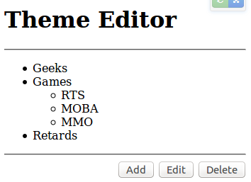

UC-0002 Сервис администрирования дерева тематик
===============================================

Исполнители
-----------

 - Борисенко Дмитрий (backend)

 - Филипп Мантров (frontend)

Описание
--------

1. Пользователь должен иметь возможность редактировать дерево тематик текущего хоста сервиса.

Основной сценарий
-----------------

- 1. По специальному адресу `/host-admin/` доступен CRUD-инструмент для создания и редактирования дерева тематик.

- 2. CRUD-инструмент состоит из:

    - 2.1 Древовидного списка тематик

        - 2.1.1 Тематику (строку) можно выделить

        - 2.1.2 При выделении конкретной тематики становятся доступными некоторые элементы управления (редактировать, удалить, ...)

    - 2.2 Управления деревом тематик

        - 2.2.1 Кнопка "Добавить тематику"

        - 2.2.2 Кнопка "Редактировать"

        - 2.2.3 Кнопка "Удалить"

- 3. Пользователь должен иметь возможность создать тематику по нажатию кнопки "Добавить тематику"

    - 3.1 Пользователю отображается всплывающее окно с выбором названия тематики

        - 3.1.1 В окне должно быть поле "Название"

        - 3.1.2 Если тематика является дочерней, то в окне должно быть readonly-поле, отображающее все дерево тематики

        - 3.1.3 В окне должна быть кнопка "Создать тематику"

    - 3.2 Пробелы и лишние символы в названии тематики должны быть удалены

    - 3.3 Если название не указано, то при попытке создания тематики под полем "Название" красным цветом отображается сообщение: "Укажите название"

    - 3.4 Если на текущем уровне уже существует тематика с тем же названием (с учетом фильтрации пробельных символов), то при попытке создания тематики пользователю под полем "Название" отображается красным цветом ошибка: "Тематика с указанным названием уже существует"

- 4. Пользователь должен иметь возможность редактировать тематику.

    - 4.1. Логика работы аналогичная форме создания тематики, но кое-какие кнопки должны быть соотвественно переименованы.

- 5. Пользователь должен иметь возможность удалить тематику.

    - 5.1. Если в тематике есть дочерние тематики, то дочерние тематики также должны быть удалены.

Технические детали
------------------

- Все API должно быть размещено со следующим префиксом: `/backend/api/protected/host-admin/theme-editor/`

- Необходимо создать отдельный бандл: `ThemeEditorBundle`

Таблица `theme`
---------------

- id, int, auto_increment

- parent_id, int, references

- title, string