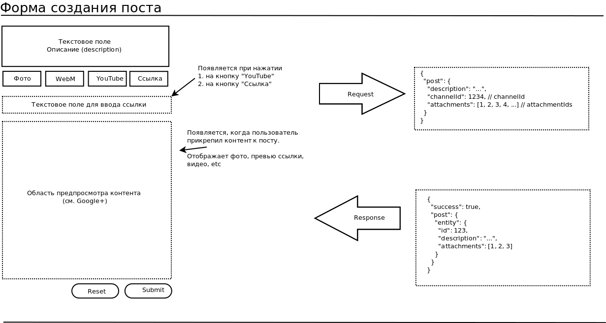

UC-0003 Форма создания поста
============================

* Незаконченная версия

Исполнители
-----------

- Филипп Мантров (фронтенд)
- Вячеслав Савушкин (бэкенд)

Ограничения/требования
----------------------

- Пост содержит в себе *описание* в виде текста и *приложения* (`attachment[]`).

- Пост обязательно прикреплен к определенному каналу. Также должна хранится информация о том, кем был создан пост.

- Посты могут быть созданы в том числе и анонимными пользователями. Данное запланировано на будущее, но это должно быть учтено
в архитектуре. REST-запросы *не должны* проходить через `/protected/`-роут.

- Под *приложение* подразумевается как загруженный пользователем файл, так и ссылка на определенный ресурс.

- Каждое *приложение* имеет свой *тип приложения* (`attachment type`):

    - `http-link`: обычная ссылка на любой ресурс
    
    - `youtube-link`: ссылка на youtube-видео
    
    - `upload-photo`: загруженный пользователем файл image/jpeg, image/png, image/gif и.т.д..
     
     - `upload-webm`: загруженный пользователем webm-файл
     
- `Типы приложения` агрегируется в наборы "типов контента" (`content type`). Например, под "Видео" подразумевается ссылки на YouTube, 
Vimeo либо на загруженные webm-файлы.

- Фронтенд отправляет информацию о приложениях в произвольном формате, но бэкенд не должен доверять фронтенду. Пример: при вставке ссылки
фронтенд загружает набор метатегов с этой страницы

- В текущей версии юзекейса пользователь может прикрепить только один аттачмент к посту. Необходимо заранее предусмотреть,
что пользователь в будущем сможет добавить сразу несколько приложений, в т.ч. и ссылки на контент

Где можно посмотреть готовую реализацию:
----------------------------------------

- Google+

- Yoofee - лента

Описание - фронтенд
-------------------



- Пользователю на специальной тестовой странице доступна *форма создания поста*
 
- Пользователь может заполнить `описание` поста.

- Пользователь может прикрепить к посту `приложение` (`attachment`):

    - Приложение загружается на сервер до того, как создан пост. 
    
    - В ответе каждого запроса на аттачмент присылается ID поста-черновика. Этот ID необходимо сохранить в памяти и после
отправлять его в каждом следующем запросы для того, чтобы не вызывалась заново процедура создания поста-черновика.

- Существует два основных варианта прикрепления приложения: *В виде файла на диске, который загружается на сервер* и *В виде ссылки*
    
    - Кнопки "webm", "фото" и любые другие кнопки, приводящие к загрузке файла на сервер, должны "взаимозаменять" друг друга. Это значит,
что если пользователь выбрал фото, а выбрал webm-файл, то пользователю не должно отображаться никаких ошибок, а форма должны корректно
загрузить и отобразить webm-файл.

    - То же самое касается и ссылок - ссылок обычных или ссылок на YouTube
    
    - Чтобы добиться этого, имеется следующее предложение: кнопки "фото", "webm" и.т.д.. должны быть по сути декоративными и вызывать
один и тот же метод, который обрабатывает файлы и определяет наиболее подходящий тип аттачмента. То же самое касается и ссылочных аттачментов.

- При вставке ссылки в `описание`, `поле для ввода ссылки` в область предпросмотра контента *по возможности* отображается 
фото, заголовок, URL и описание данной ссылки.

    - При вставке ссылки срабатывает обычный механизм прикрепления аттачмента.
    
    - Данный механизм не должен срабатывать, если в поле предпросмотра контента уже есть содержимое.
  
    - Данную информацию можно получить из специальных метатегов: [https://developers.facebook.com/docs/sharing/webmasters#markup]()
    
- При прикреплении фото или вебм в область предпросмотра контента отображается прикрепленный пользователем файл.

- Пользователь может полностью сбросить состояние формы, нажав на Reset.

- Пользователь может отправить результат своей работы, нажав на Submit.

Описание - бэкенд
-----------------

- Необходимо реализовать основные сущности - `Domain\Post`, `Attachment`, `AttachmentType` (в виде уже предзаполненной таблицы).

    - Документ "видение проекта" по прежнему актуален. Там можно получить более подробную информацию об этих сущностях.
    
    - Пост может быть в состоянии "создан" (или "отправлен") либо в состоянии "черновик" (т.е. пользователь загружает для этого поста
приложения, но еще не нажал на кнопку "отправить").

    - Необходимо реализовать инструмент / демон, который периодически удаляет черновики, которые слишком долго хранились 
на сервере (например, три дня) вместе с их аттачментами; а также удаляет аттачменты, которые слишком долго хранились на сервере
и не были востребованы.
    
- Необходимо реализовать REST-инструменты по созданию, обновлению, удалению поста.

- Необходимо реализовать REST-инструмент по прикреплению приложений к посту.

    - Если с фронтенда не пришел ID поста, то должен автоматически быть создан пост в состоянии "черновик"
    
    - Для приложения типа `http-link` (в будущем - для некоторых других тоже) необходимо в ответе отправлять информацию о 
всех содержащихся в странице метатегах, их название и их значение, а также значение тега `<title>` 

    - Ответ должен быть примерно следующего вида:
    
```

{

        "success": true,
        "postId": 123, // Domain\Post ID нужен фронтендщику - он сохранит значение этого поста и в будущем уже будет отправлять аттачменты с указанным PostID
        "attachment": {
            "entity": {
                id: 12345,
                postId: 5667,
                properties: {
                    // Набор свойств может быть абсолютно любым. Для ссылки есть сохраненный набор метатегов, 
                    // для прикрепленного файла - URL, где лежит файл и абсолютный путь к файлу и.т.д..
                    // Рекомендую для упрощения разработки воспользоваться доктриновским типом array(json)
                }
            }
        }
    }
```
